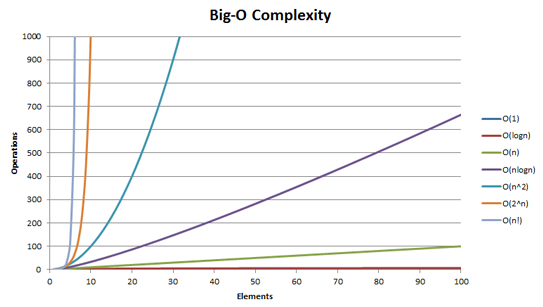

> 취업과 이직을 위한 프로그래머스 코딩테스트 문제 풀이 전략:자바편 책을 참고하여 작성하였습니다.

## 시간복잡도(Time Complexity)

코딩테스트에서 시간 복잡도는 빅오 표기법 (Big-O)을 사용한다. 빅오 표기법은 알고리즘이 겪을 수 있는 최악의 경우에 걸리는 시간과 입력 간의 상관관계를 표기한다.
입력 크기가 N이고, 이예 비례하는 시간이 걸린다면 O(N)으로 표기한다.

| 알고리즘  | 시간복잡도            |
|-------|------------------|
| 이진 탐색 | O(logN)          |
| 선형 탐색 | O(N)             |
| 정렬    | O(NlogN)         |
| 조합    | O(2N) |
| 순열    | O(N!)            |

오른쪽으로 갈 수록 오래걸리는 빅오 표기이다.

> O(1) < O(logN) < O(N) < O(NlogN) < O(N2) < O(22) < O(N!)

N이 커질 수록 그 차이는 어마어마 하다. 때문에 특히 대규모 서비스에서는 시간 복잡도가 효율적인 코드가 중요하다.

보통, 1초를 기준으로 시간 복잡도 대입 결과가 1억(108)을 넘지 않는다면 1초보다 빠른 효율적인 코드일 가능성이 높다.
딱 1억이 된다면 간당간당하다. 아무리 커도 1억을 넘기면 안된다.

> 1억은 절대적인 기준이 아니다. 보통 코딩테스트 문제는 1억에 간당간당하도록 문제를 내지 않는다. 1억을 훨씬 밑돌거나, 풀이가 잘못되면 훨씬 상회하도록 짜여져있다.
> 1억은 1초 기준이기 때문에, 3초이면 3억으로 계산하면 된다.
> 시간 제한이 걸려 있지 않는 문제라도, 대부분의 코드는 10초 이내에 실행 완료되어야 한다. 따라서 시간 복잡도를 계산한 결과가 10억이 넘어간다면 반드시 다른 풀이를 생각해야 한다.

주어진 실행 시간을 상회하여 시간 초과로 실패하는 경우는 빈번하다. 풀이를 고안하는 것이 아니라, 코드를 작성 한 후에 변경하려면 코드를 모두 새로 작성해야 한다.
따라서, 코드를 작성하기 전에 먼저 시간을 초과하지 않는 풀이를 생각하고, **효율성이 검증**되면 그 이후에 코드를 작성해야 한다.

### 제한 시간이 1초일 때 유추 가능한 알고리즘
|N| 유추 가능한 시간 복잡도                          |유추 가능한 알고리즘|
|--|----------------------------------------|--|
|10| O(N!)                                  |순열|
|20| O(2N)                       |조합|
|1,000~| O(N3), O(N3logN) |완전 탐색, 이진 탐색
|10,000~| O(NlogN)                               |정렬, 이진 탐색|

어디까지나 힌트로 사용해야 함.